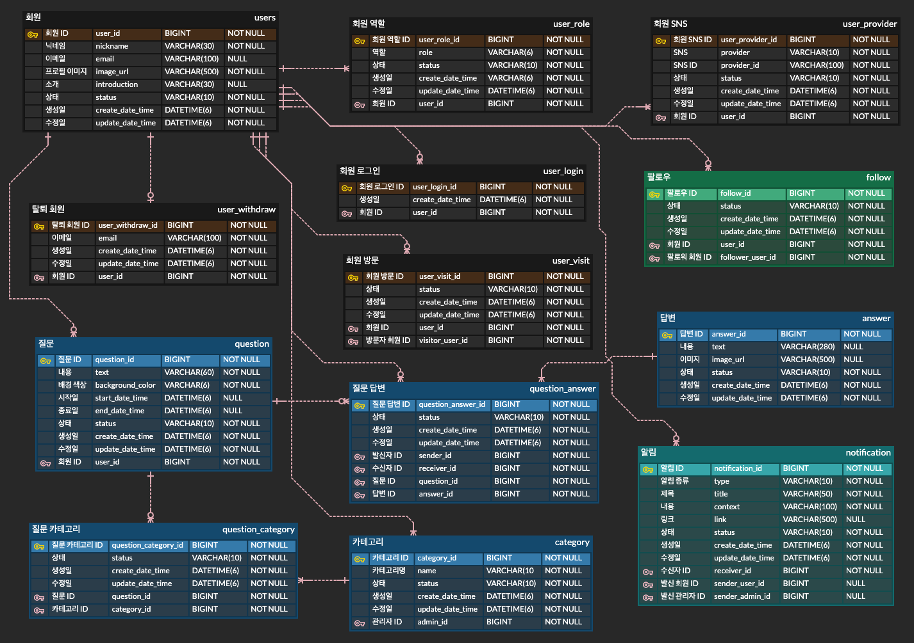

# 우물우물

### 나에 대해 알아가자

---

## Link

- ### [API Status](https://uptime.nogamsung.com/status/woomulwoomul)
- ### [Convention](docs/convention.md)
- ### [Client Repository](https://github.com/woomulwoomul/woomulwoomul-frontend)

---

## Module Architecture

---

## Server Architecture

---

## Database

---

## CI/CD Pipeline

---

## Monitoring

- ### [Uptime Kuma](https://uptime.nogamsung.com/status/woomulwoomul)
- ### Sentry
